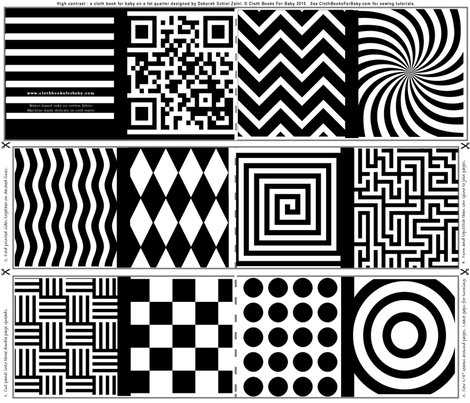
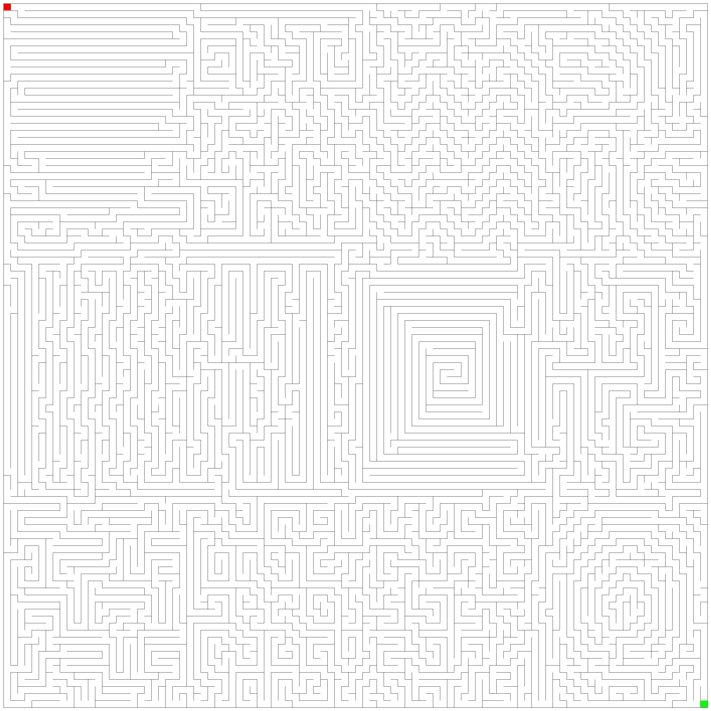
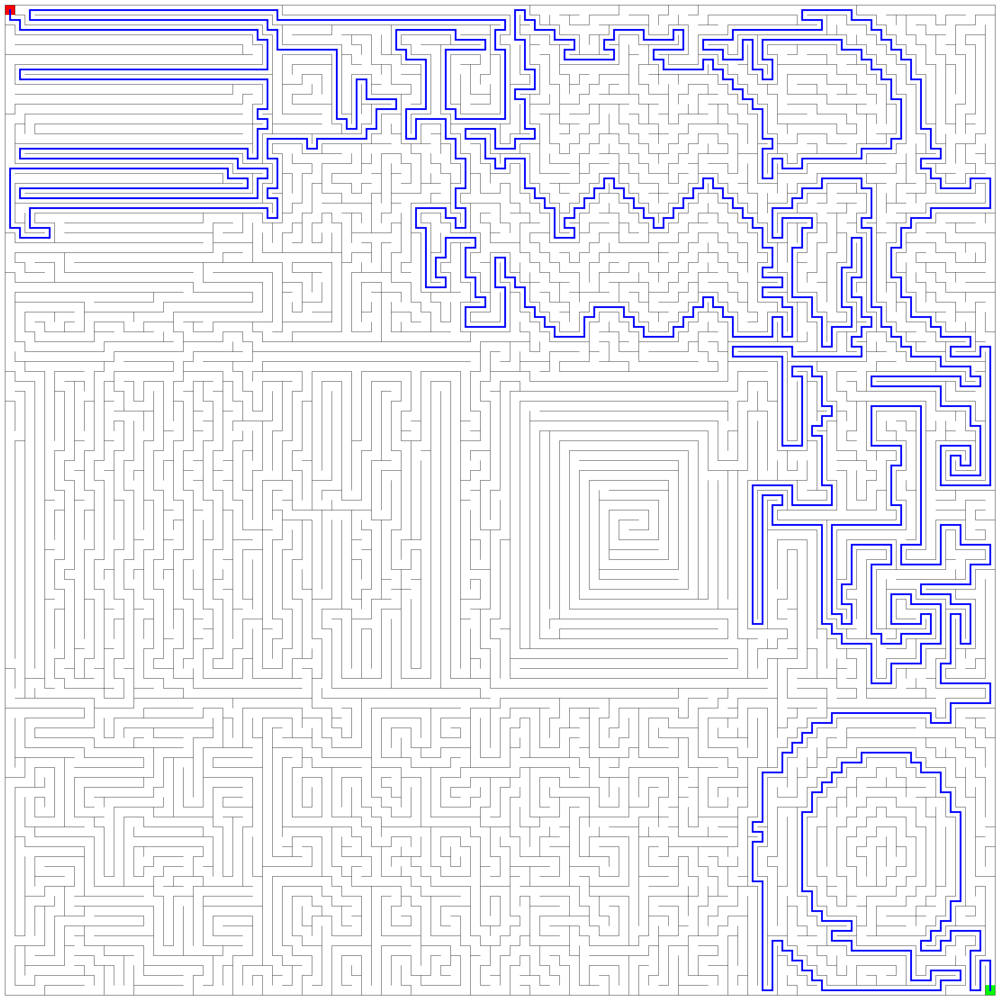

# gomaze

A Golang maze generator for having fun traversing graphs and encoding pngs

# Notes:
- The maze generator can take a bias input png that it will impact the maze that is generated (see below). All the generated mazes will be similar but not exactly the same. This is all very basic and naive right now but could get better with some basic edge detection.

- Outputs are encoded to png (for now)

- I am not being efficient at all in the encoding step (and that is the dominating factor when generating these mazes of arbitrary size. It can definitely be improved and parallelized).

# Example
## Input

## Maze

## Solution

